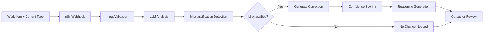

<div align="center">

# 🧠 Flow Type Corrector

### LLM-Powered Flow Item Type Validation & Correction

[](https://github.com/chrisgallivan123/flow-type-corrector/actions)
[](LICENSE)
[](https://n8n.io)
[](https://python.org)

**Identify and correct misapplied Flow Item Types using LLM-based textual analysis**

[What It Does](#-what-this-tool-does) • [Quick Start](#-quick-start) • [Why This Matters](#-why-this-experiment-was-valuable) • [Documentation](#-documentation)

</div>

---

## 🎯 Overview

The **Flow Type Corrector** uses a Large Language Model (LLM) to inspect the text of work items (titles, descriptions, and notes) to **detect when a Flow Item Type has been applied incorrectly**. It then recommends a corrected Flow Item Type based on commonly accepted Flow Framework® best practices.

This tool does **not** classify unlabeled work from scratch. Its purpose is to **find misclassifications and propose corrected Flow Item Types** for human review.

The output is formatted for compatibility with the **viz-turbo** application for visualization and analysis.

### 💡 The Problem

Flow Metrics depend on accurate Flow Item Type classification, but teams frequently misapply types:
- ❌ Features labeled as Defects (or vice versa)
- ❌ Technical Debt work misclassified as Features
- ❌ Risks not properly identified
- ❌ Inconsistent classification patterns across teams

**Real-World Impact:** In early testing across multiple datasets, this approach surfaced **up to 25% misclassified Flow Item Types**. Correcting these misapplications significantly improved the clarity of Flow Metrics and supported better decision making during Flow Reviews.

### ✨ What This Tool Does

- ✅ **Reviews Existing Classifications** – Evaluates if current Flow Item Types appear misapplied
- ✅ **Suggests Corrections** – Recommends more appropriate Flow Item Types when needed
- ✅ **Follows Flow Framework® Patterns** – Applies standard Flow Item Type definitions
- ✅ **Outputs Structured Results** – Formats data for review and visualization via **viz-turbo**
- ✅ **Human-in-the-Loop** – Designed for review, not automatic updates
- ✅ **Audit Trail** – Provides detailed reasoning for every suggestion

## 🔍 Input Requirements

### Minimum Required Fields

- **Title** – Work item title/summary
- **Current Flow Item Type** – The type currently assigned
- **Description** – Work item description/details

### Optional Fields (Improve Accuracy)

- Acceptance criteria
- Comments or notes
- Additional context fields

The more contextual information provided, the more accurate the misclassification detection becomes.

---

## 📤 Output Format (Viz-Turbo Compatible)

Each record includes the original type, suggested correction, confidence score, and reasoning:

```json
{
  "id": "ABC-123",
  "current_type": "Feature",
  "suggested_type": "Defect",
  "confidence": 0.87,
  "reasoning": "Text references fixes, errors, and regressions, indicating defect-related work."
}
```

### Supported Flow Item Types

| Type | Description | Common Indicators |
|------|-------------|-------------------|
| **Feature** | New functionality or capability | "Add", "Implement", "Create", user value |
| **Defect** | Bugs and errors requiring fixes | "Fix", "Bug", "Error", "Broken" |
| **Risk** | Potential issues or concerns | "Security", "Vulnerability", "Risk" |
| **Debt** | Technical debt and improvements | "Refactor", "Technical debt", "Cleanup" |

---

## ⚡ Core Capabilities

| Feature | Description |
|---------|-------------|
| 🔍 **Misclassification Detection** | Identifies incorrectly applied Flow Item Types based on textual analysis |
| 🤖 **LLM-Powered Analysis** | Uses advanced language models to understand work item context |
| 📊 **Batch Processing** | Efficiently process hundreds of work items at once |
| 📈 **Confidence Scoring** | Provides transparency on suggestion certainty |
| 🔄 **CI/CD Pipeline** | Automated testing and deployment via GitHub Actions |
| 📝 **Detailed Reasoning** | Complete rationale for every suggested correction |
| 🎯 **Viz-Turbo Integration** | Outputs formatted for immediate visualization and analysis |
| 🛡️ **Human Review Required** | Designed for human-in-the-loop validation, not automatic updates |

---

## 🚀 Quick Start

### Prerequisites

- **n8n** instance (self-hosted or cloud)
- **Python 3.8+**
- **LLM API access** (OpenAI, Anthropic, or compatible provider)
- Work items exported from your project management system (CSV or API)

### 1️⃣ Import Workflow into n8n

```bash
# Clone the repository
git clone https://github.com/chrisgallivan123/flow-type-corrector.git
cd flow-type-corrector
```

1. Open your n8n instance
2. Navigate to **Workflows** → **Import from File**
3. Select [`workflow/flow-type-corrector-prod.json`](workflow/flow-type-corrector-prod.json)
4. Configure your LLM provider credentials
5. Note the webhook URL for API access

### 2️⃣ Set Up Development Environment

```bash
# Create virtual environment
python3 -m venv .venv
source .venv/bin/activate  # On Windows: .venv\Scripts\activate

# Install dependencies
pip install -r requirements.txt

# Export webhook URL
export WEBHOOK_URL="https://your-n8n-instance.com/webhook/flow-type-corrector"
```

### 3️⃣ Process Your Work Items

```bash
# Single work item validation
python scripts/send_sample.py \
  --title "Fix 500 error on SSO callback" \
  --current-type "Feature" \
  --description "NullPointerException on token refresh; add null check"

# Batch validation and correction
python scripts/batch_classify.py \
  --in examples/sample.csv \
  --out examples/predictions.csv \
  --webhook $WEBHOOK_URL

# Evaluate correction accuracy
python scripts/evaluate.py \
  --gold examples/sample.csv \
  --pred examples/predictions.csv
```

### 4️⃣ Review Suggestions

```bash
# Load output into viz-turbo for visualization
# Review suggested corrections
# Apply approved corrections to your source system
```

**Expected Output:**
```json
{
  "id": "PROJ-456",
  "current_type": "Feature",
  "suggested_type": "Defect",
  "confidence": 0.92,
  "reasoning": "Work item describes fixing a 500 error caused by NullPointerException. Keywords 'Fix', 'error', and technical bug indicators suggest this is defect work, not a new feature."
}
```

## 🏗️ How It Works

### Processing Pipeline



### Simple Summary

1. **Load Work Items** – CSV or API export with existing Flow Item Types
2. **LLM Evaluation** – Analyzes textual clues to assess correctness of current type
3. **Misclassification Detection** – Identifies when Flow Item Type appears incorrect
4. **Suggestion Generation** – Recommends corrected type only when misclassification is likely
5. **Human Review** – Results exported for analysis, visualization, or correction

### What Makes This Useful

This tool **validates existing classifications** rather than assigning types from scratch. This approach:
- Catches common misclassification patterns
- Improves data quality for Flow Metrics
- Helps teams learn appropriate Flow Item Type usage
- Provides coaching opportunities during Flow Reviews

📖 **Detailed Documentation:** See [`docs/architecture.md`](docs/architecture.md) for comprehensive diagrams, decision logic, and extension points.

---

## 📁 Project Structure

```
flow-type-corrector/
│
├── 📂 workflow/                    # n8n Workflow Definitions
│   └── flow-type-corrector-prod.json
│
├── 📂 scripts/                     # Automation & Testing Tools
│   ├── send_sample.py             # Single work item testing
│   ├── batch_classify.py          # Bulk classification
│   └── evaluate.py                # Accuracy metrics & evaluation
│
├── 📂 examples/                    # Sample Data & Outputs
│   ├── sample.csv                 # Example work items with labels
│   └── predictions.csv            # Classification results
│
├── 📂 tests/                       # Test Suite
│   └── test_schema.py             # Schema validation tests
│
├── 📂 docs/                        # Documentation
│   └── architecture.md            # Detailed system design
│
├── 📂 .github/                     # GitHub Configuration
│   ├── workflows/
│   │   └── ci.yml                 # CI/CD pipeline
│   ├── ISSUE_TEMPLATE/            # Issue templates
│   └── PULL_REQUEST_TEMPLATE.md   # PR template
│
├── 📄 requirements.txt             # Python dependencies
├── 📄 Makefile                     # Development commands
├── 📄 .pre-commit-config.yaml     # Code quality hooks
├── 📄 CONTRIBUTING.md              # Contribution guidelines
├── 📄 CODE_OF_CONDUCT.md           # Community standards
├── 📄 SECURITY.md                  # Security policy
└── 📄 LICENSE                      # MIT License
```

---

## ⚙️ Configuration

### Environment Variables

| Variable | Description | Required | Example |
|----------|-------------|----------|---------|
| `WEBHOOK_URL` | n8n webhook endpoint | Yes | `https://n8n.example.com/webhook/...` |
| `DEBUG` | Enable verbose logging | No | `true` or `false` (default) |
| `LLM_PROVIDER` | LLM service provider | Yes | `openai`, `anthropic`, `azure` |
| `LLM_MODEL` | Specific model to use | No | `gpt-4`, `claude-3-opus` |

### Workflow Settings

Configure these within your n8n workflow:
- **Timeout**: Recommended 30s for LLM responses
- **Retry Logic**: 3 attempts with exponential backoff
- **Rate Limiting**: Configurable per API provider limits

## 🧪 Development & Testing

### Running Tests

```bash
# Run all tests
make test

# Run with coverage
make test-coverage

# Run specific test file
pytest tests/test_schema.py -v
```

### Pre-commit Hooks

This project uses pre-commit hooks to maintain code quality:

```bash
# Install pre-commit
pip install pre-commit

# Set up git hooks
pre-commit install

# Run manually on all files
pre-commit run --all-files
```

### Code Quality Tools

- **Black** – Code formatting
- **isort** – Import sorting
- **flake8** – Linting
- **mypy** – Type checking
- **pytest** – Testing framework

---

## 🛠️ Tech Stack

<div align="center">

| Category | Technologies |
|----------|-------------|
| **Workflow Automation** | n8n (workflow orchestration) |
| **AI/ML** | OpenAI GPT-4, Anthropic Claude |
| **Language** | Python 3.8+ |
| **Testing** | pytest, pre-commit |
| **CI/CD** | GitHub Actions |
| **Data Format** | CSV, JSON (viz-turbo compatible) |
| **Integration** | viz-turbo (visualization) |

</div>

---

## 📊 Real-World Results

In early testing across multiple Flow Framework® datasets:

- **~25% misclassification rate detected** across work items
- Corrections significantly improved Flow Metric clarity
- Enabled better decision-making during Flow Reviews
- Provided actionable coaching opportunities for teams

**Note:** Results vary by team, classification consistency, and data quality. This tool surfaces potential issues for human review—it does not guarantee accuracy and should be used as part of a broader data quality process.

---

## 🎯 Why This Experiment Was Valuable

Building the Flow Type Corrector provided a practical way to explore key LLM configuration tradeoffs in a controlled, real-world scenario:

| Variable | What Was Explored |
|----------|-------------------|
| **Batch Size** | Impact on throughput and consistency of outputs |
| **Temperature** | Determinism vs. creativity for classification tasks |
| **Accuracy vs. Performance** | Balancing speed, cost, and quality |
| **Deterministic Response Tuning** | Ensuring repeatable, reviewable recommendations |
| **Prompt Engineering** | Optimal prompting patterns for validation tasks |

This helped determine optimal model settings and prompting strategies for classification-style workloads, with practical insights applicable to similar LLM-based validation tools.

---

## 🧪 Intended Usage

This tool is ideal for:

- ✅ **Improving Flow Metric Reliability** – Cleaner data leads to better insights
- ✅ **Pre-Analysis Data Quality Checks** – Detect misapplications before Flow Reviews
- ✅ **Team Coaching** – Help teams understand appropriate Flow Item Type usage
- ✅ **Viz-Turbo Preparation** – Prepare datasets for visualization and analysis
- ✅ **Data Hygiene Audits** – Periodic validation of Flow Item Type consistency

**Important:** This tool is designed for **human-in-the-loop review**, not automatic updates. Suggestions should be reviewed and validated before applying to source systems.

---

## 🚧 Out of Scope (By Design)

To set clear expectations about what this tool does **not** do:

| What It Doesn't Do | Why |
|-------------------|-----|
| ❌ Assign Flow Types to unlabeled work | Requires existing classification to validate |
| ❌ Guarantee 100% correctness | Suggestions require human review and approval |
| ❌ Write changes back to Jira/ADO/etc. | Outputs require manual or scripted application |
| ❌ Replace human judgment | Designed to assist, not replace, classification decisions |

---

## 🤝 Contributing

We welcome contributions! This project follows a standard open-source workflow:

1. 🍴 **Fork** the repository
2. 🌱 **Create** a feature branch (`git checkout -b feature/amazing-feature`)
3. 💾 **Commit** your changes (`git commit -m 'Add amazing feature'`)
4. 📤 **Push** to the branch (`git push origin feature/amazing-feature`)
5. 🎉 **Open** a Pull Request

Please read [`CONTRIBUTING.md`](CONTRIBUTING.md) for detailed guidelines, code standards, and the development process.

### Development Workflow

```bash
# Clone and setup
git clone https://github.com/chrisgallivan123/flow-type-corrector.git
cd flow-type-corrector
make setup

# Make changes and test
make test
make lint

# Submit PR
git push origin feature/your-feature
```

---

## 📖 Documentation

| Document | Description |
|----------|-------------|
| [Architecture Guide](docs/architecture.md) | Detailed system design and decision logic |
| [Contributing Guide](CONTRIBUTING.md) | How to contribute to the project |
| [Code of Conduct](CODE_OF_CONDUCT.md) | Community guidelines and expectations |
| [Security Policy](SECURITY.md) | Vulnerability reporting and security practices |

---

## 📜 License

This project is licensed under the **MIT License** - see the [LICENSE](LICENSE) file for details.

```
MIT License - Free for commercial and private use
```

---

## 🔒 Security

Security is a top priority. If you discover a vulnerability:

- **DO NOT** open a public issue
- Review our [Security Policy](SECURITY.md)
- Report privately via GitHub Security Advisories

---

## 🌟 Show Your Support

If you find this project useful, please consider:

- ⭐ **Starring** the repository
- 🐛 **Reporting** bugs or issues
- 💡 **Suggesting** new features
- 🤝 **Contributing** code or documentation

---

## 📧 Contact & Maintainers

**Maintainer:** [@chrisgallivan123](https://github.com/chrisgallivan123)

For questions, suggestions, or collaboration opportunities, feel free to:
- Open an issue
- Start a discussion
- Reach out via GitHub

---

## 🙏 Acknowledgments

- Built with [n8n](https://n8n.io) - Fair-code workflow automation
- Powered by state-of-the-art LLMs (OpenAI, Anthropic)
- Inspired by [Flow Framework®](https://flowframework.org/) methodology
- Designed for use with **viz-turbo** visualization tools
- Thanks to all contributors and users who helped validate this approach

---

<div align="center">

**[⬆ Back to Top](#-flow-type-corrector)**

Made with ❤️ and ☕ by [Chris Gallivan](https://github.com/chrisgallivan123)

</div>
