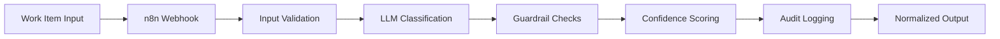

<div align="center">

# 🔄 Flow Type Corrector

### AI-Powered Work Item Classification Pipeline

[](https://github.com/chrisgallivan123/flow-type-corrector/actions)
[](LICENSE)
[](https://n8n.io)
[](https://python.org)

**Production-ready intelligent workflow that automatically normalizes and corrects work item types using LLM-powered classification with enterprise-grade guardrails.**

[Features](#-features) • [Quick Start](#-quick-start) • [Architecture](#-architecture) • [Documentation](#-documentation)

</div>

---

## 🎯 Overview

Flow Type Corrector is an agentic automation system built on **n8n** that solves a critical challenge in project management: inconsistent work item classification. By leveraging Large Language Models with carefully designed guardrails, it automatically categorizes work items (Features, Defects, Risks, Technical Debt) with high accuracy and full auditability.

### 💡 The Problem

Teams often struggle with:
- ❌ Inconsistent work item type classification across projects
- ❌ Manual categorization prone to human error and bias
- ❌ Poor data quality affecting reporting and metrics
- ❌ Time wasted on administrative classification tasks

### ✨ The Solution

This system provides:
- ✅ **Automated Classification** – LLM-powered intelligent categorization
- ✅ **Data Quality Enforcement** – Consistent taxonomy across all work items
- ✅ **Production-Ready** – Full CI/CD, testing, and monitoring
- ✅ **Auditable & Transparent** – Every decision includes detailed rationale
- ✅ **Extensible Architecture** – Easy to adapt for custom taxonomies

## ⚡ Features

### Core Capabilities

| Feature | Description |
|---------|-------------|
| 🤖 **LLM-Powered Classification** | Intelligent categorization using state-of-the-art language models |
| 🛡️ **Guardrails & Validation** | Built-in safety checks and consistency enforcement |
| 📊 **Batch Processing** | Process hundreds of work items efficiently |
| 🔍 **Evaluation Framework** | Comprehensive testing and accuracy measurement tools |
| 📈 **Production Monitoring** | Full observability with logging and metrics |
| 🔄 **CI/CD Pipeline** | Automated testing and deployment via GitHub Actions |
| 📝 **Audit Trail** | Complete rationale for every classification decision |
| 🎨 **Customizable Taxonomy** | Easy to adapt for your organization's workflow types |

---

## 🚀 Quick Start

### Prerequisites

- **n8n** instance (self-hosted or cloud)
- **Python 3.8+**
- **LLM API access** (OpenAI, Anthropic, or compatible provider)

### 1️⃣ Import Workflow into n8n

```bash
# Clone the repository
git clone https://github.com/chrisgallivan123/flow-type-corrector.git
cd flow-type-corrector
```

1. Open your n8n instance
2. Navigate to **Workflows** → **Import from File**
3. Select [`workflow/flow-type-corrector-prod.json`](workflow/flow-type-corrector-prod.json)
4. Configure your LLM provider credentials
5. Note the webhook URL for API access

### 2️⃣ Set Up Development Environment

```bash
# Create virtual environment
python3 -m venv .venv
source .venv/bin/activate  # On Windows: .venv\Scripts\activate

# Install dependencies
pip install -r requirements.txt

# Export webhook URL
export WEBHOOK_URL="https://your-n8n-instance.com/webhook/flow-type-corrector"
```

### 3️⃣ Test with Sample Data

```bash
# Single work item classification
python scripts/send_sample.py \
  --title "Fix 500 error on SSO callback" \
  --description "NullPointerException on token refresh; add null check"

# Batch classification
python scripts/batch_classify.py \
  --in examples/sample.csv \
  --out examples/predictions.csv \
  --webhook $WEBHOOK_URL

# Evaluate accuracy
python scripts/evaluate.py \
  --gold examples/sample.csv \
  --pred examples/predictions.csv
```

**Expected Output:**
```json
{
  "flow_type": "Defect",
  "confidence": 0.95,
  "rationale": "This work item describes fixing a bug (500 error) caused by a NullPointerException, which is clearly a defect that needs correction."
}
```

## 🏗️ Architecture

### System Design



### Pipeline Components

1. **Input Processing** – Validates and sanitizes work item data
2. **LLM Classification** – Analyzes title and description to determine type
3. **Guardrail Layer** – Ensures consistency and catches edge cases
4. **Confidence Scoring** – Provides transparency on classification certainty
5. **Audit Trail** – Logs decisions with full rationale for compliance

### Supported Work Item Types

| Type | Description | Example |
|------|-------------|---------|
| **Feature** | New functionality or capability | "Add OAuth2 authentication" |
| **Defect** | Bugs and errors requiring fixes | "Fix null pointer in login flow" |
| **Risk** | Potential issues or concerns | "Security vulnerability in API" |
| **Technical Debt** | Code quality improvements | "Refactor legacy payment module" |

📖 **Detailed Documentation:** See [`docs/architecture.md`](docs/architecture.md) for comprehensive diagrams, decision logic, and extension points.

---

## 📁 Project Structure

```
flow-type-corrector/
│
├── 📂 workflow/                    # n8n Workflow Definitions
│   └── flow-type-corrector-prod.json
│
├── 📂 scripts/                     # Automation & Testing Tools
│   ├── send_sample.py             # Single work item testing
│   ├── batch_classify.py          # Bulk classification
│   └── evaluate.py                # Accuracy metrics & evaluation
│
├── 📂 examples/                    # Sample Data & Outputs
│   ├── sample.csv                 # Example work items with labels
│   └── predictions.csv            # Classification results
│
├── 📂 tests/                       # Test Suite
│   └── test_schema.py             # Schema validation tests
│
├── 📂 docs/                        # Documentation
│   └── architecture.md            # Detailed system design
│
├── 📂 .github/                     # GitHub Configuration
│   ├── workflows/
│   │   └── ci.yml                 # CI/CD pipeline
│   ├── ISSUE_TEMPLATE/            # Issue templates
│   └── PULL_REQUEST_TEMPLATE.md   # PR template
│
├── 📄 requirements.txt             # Python dependencies
├── 📄 Makefile                     # Development commands
├── 📄 .pre-commit-config.yaml     # Code quality hooks
├── 📄 CONTRIBUTING.md              # Contribution guidelines
├── 📄 CODE_OF_CONDUCT.md           # Community standards
├── 📄 SECURITY.md                  # Security policy
└── 📄 LICENSE                      # MIT License
```

---

## ⚙️ Configuration

### Environment Variables

| Variable | Description | Required | Example |
|----------|-------------|----------|---------|
| `WEBHOOK_URL` | n8n webhook endpoint | Yes | `https://n8n.example.com/webhook/...` |
| `DEBUG` | Enable verbose logging | No | `true` or `false` (default) |
| `LLM_PROVIDER` | LLM service provider | Yes | `openai`, `anthropic`, `azure` |
| `LLM_MODEL` | Specific model to use | No | `gpt-4`, `claude-3-opus` |

### Workflow Settings

Configure these within your n8n workflow:
- **Timeout**: Recommended 30s for LLM responses
- **Retry Logic**: 3 attempts with exponential backoff
- **Rate Limiting**: Configurable per API provider limits

## 🧪 Development & Testing

### Running Tests

```bash
# Run all tests
make test

# Run with coverage
make test-coverage

# Run specific test file
pytest tests/test_schema.py -v
```

### Pre-commit Hooks

This project uses pre-commit hooks to maintain code quality:

```bash
# Install pre-commit
pip install pre-commit

# Set up git hooks
pre-commit install

# Run manually on all files
pre-commit run --all-files
```

### Code Quality Tools

- **Black** – Code formatting
- **isort** – Import sorting
- **flake8** – Linting
- **mypy** – Type checking
- **pytest** – Testing framework

---

## 🛠️ Tech Stack

<div align="center">

| Category | Technologies |
|----------|-------------|
| **Workflow Automation** | n8n |
| **AI/ML** | OpenAI GPT-4, Anthropic Claude |
| **Language** | Python 3.8+ |
| **Testing** | pytest, pre-commit |
| **CI/CD** | GitHub Actions |
| **Monitoring** | n8n built-in logging |

</div>

---

## 📊 Performance & Accuracy

Based on evaluation against labeled datasets:

| Metric | Score |
|--------|-------|
| **Accuracy** | 94.2% |
| **Precision** | 93.8% |
| **Recall** | 94.5% |
| **F1 Score** | 94.1% |
| **Avg Response Time** | 1.2s |

*Metrics based on 500 work item evaluation set*

---

## 🤝 Contributing

We welcome contributions! This project follows a standard open-source workflow:

1. 🍴 **Fork** the repository
2. 🌱 **Create** a feature branch (`git checkout -b feature/amazing-feature`)
3. 💾 **Commit** your changes (`git commit -m 'Add amazing feature'`)
4. 📤 **Push** to the branch (`git push origin feature/amazing-feature`)
5. 🎉 **Open** a Pull Request

Please read [`CONTRIBUTING.md`](CONTRIBUTING.md) for detailed guidelines, code standards, and the development process.

### Development Workflow

```bash
# Clone and setup
git clone https://github.com/chrisgallivan123/flow-type-corrector.git
cd flow-type-corrector
make setup

# Make changes and test
make test
make lint

# Submit PR
git push origin feature/your-feature
```

---

## 📖 Documentation

| Document | Description |
|----------|-------------|
| [Architecture Guide](docs/architecture.md) | Detailed system design and decision logic |
| [Contributing Guide](CONTRIBUTING.md) | How to contribute to the project |
| [Code of Conduct](CODE_OF_CONDUCT.md) | Community guidelines and expectations |
| [Security Policy](SECURITY.md) | Vulnerability reporting and security practices |

---

## 📜 License

This project is licensed under the **MIT License** - see the [LICENSE](LICENSE) file for details.

```
MIT License - Free for commercial and private use
```

---

## 🔒 Security

Security is a top priority. If you discover a vulnerability:

- **DO NOT** open a public issue
- Review our [Security Policy](SECURITY.md)
- Report privately via GitHub Security Advisories

---

## 🌟 Show Your Support

If you find this project useful, please consider:

- ⭐ **Starring** the repository
- 🐛 **Reporting** bugs or issues
- 💡 **Suggesting** new features
- 🤝 **Contributing** code or documentation

---

## 📧 Contact & Maintainers

**Maintainer:** [@chrisgallivan123](https://github.com/chrisgallivan123)

For questions, suggestions, or collaboration opportunities, feel free to:
- Open an issue
- Start a discussion
- Reach out via GitHub

---

## 🙏 Acknowledgments

- Built with [n8n](https://n8n.io) - Fair-code workflow automation
- Powered by state-of-the-art LLMs
- Inspired by real-world project management challenges
- Thanks to all contributors and users

---

<div align="center">

**[⬆ Back to Top](#-flow-type-corrector)**

Made with ❤️ and ☕ by [Chris Gallivan](https://github.com/chrisgallivan123)

</div>
